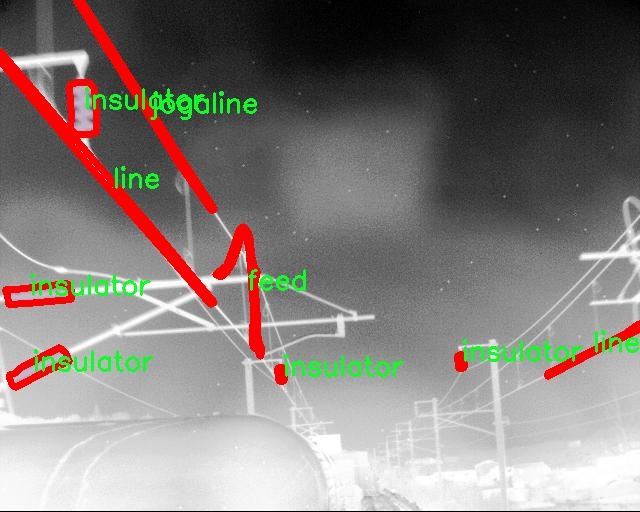

# 有轨电车热管理组件分割系统源码＆数据集分享
 [yolov8-seg-AIFI＆yolov8-seg-goldyolo等50+全套改进创新点发刊_一键训练教程_Web前端展示]

### 1.研究背景与意义

项目参考[ILSVRC ImageNet Large Scale Visual Recognition Challenge](https://gitee.com/YOLOv8_YOLOv11_Segmentation_Studio/projects)

项目来源[AAAI Global Al lnnovation Contest](https://kdocs.cn/l/cszuIiCKVNis)

研究背景与意义

随着城市化进程的加快，公共交通系统的需求日益增加，有轨电车作为一种高效、环保的交通工具，逐渐成为城市交通的重要组成部分。然而，有轨电车在运行过程中，尤其是在高负荷和复杂环境下，热管理问题显得尤为突出。热管理组件的有效分割与识别，对于提升有轨电车的运行安全性和舒适性、延长设备的使用寿命、降低维护成本具有重要意义。因此，开发一种高效的热管理组件分割系统，能够为有轨电车的热管理提供强有力的技术支持。

近年来，深度学习技术的迅猛发展为图像分割任务提供了新的解决方案。YOLO（You Only Look Once）系列模型因其高效的实时检测能力而广泛应用于各类视觉任务。YOLOv8作为该系列的最新版本，结合了更为先进的网络结构和优化算法，具备了更高的精度和更快的处理速度。通过对YOLOv8进行改进，可以进一步提升其在复杂场景下的分割性能，使其更适合于有轨电车热管理组件的识别与分割任务。

本研究将基于改进的YOLOv8模型，构建一个专门针对有轨电车热管理组件的分割系统。数据集ITX_Thermal_seg包含1500张图像，涵盖了四个主要类别：feed、insulator、jogaline和line。这些类别代表了有轨电车热管理系统中的关键组件，准确的分割与识别这些组件，将为后续的热管理分析提供基础数据支持。通过对这些组件的有效分割，能够实现对热管理系统的全面监控，及时发现潜在的故障隐患，进而提高有轨电车的安全性和可靠性。

此外，研究的意义还体现在对智能交通系统的推动上。随着人工智能技术的不断进步，智能交通系统的构建已成为未来城市发展的重要方向。通过引入基于深度学习的热管理组件分割系统，可以为有轨电车的智能化管理提供数据支持，助力实现实时监控与智能决策，提升城市公共交通的整体运营效率。

综上所述，基于改进YOLOv8的有轨电车热管理组件分割系统的研究，不仅能够解决当前有轨电车在热管理方面面临的挑战，还将为智能交通系统的建设提供新的思路与方法。通过深入分析与应用这一技术，期望能够推动有轨电车的智能化发展，为城市交通的可持续发展贡献力量。

### 2.图片演示


##### 注意：由于此博客编辑较早，上面“2.图片演示”和“3.视频演示”展示的系统图片或者视频可能为老版本，新版本在老版本的基础上升级如下：（实际效果以升级的新版本为准）

  （1）适配了YOLOV8的“目标检测”模型和“实例分割”模型，通过加载相应的权重（.pt）文件即可自适应加载模型。

  （2）支持“图片识别”、“视频识别”、“摄像头实时识别”三种识别模式。

  （3）支持“图片识别”、“视频识别”、“摄像头实时识别”三种识别结果保存导出，解决手动导出（容易卡顿出现爆内存）存在的问题，识别完自动保存结果并导出到tempDir中。

  （4）支持Web前端系统中的标题、背景图等自定义修改，后面提供修改教程。

  另外本项目提供训练的数据集和训练教程,暂不提供权重文件（best.pt）,需要您按照教程进行训练后实现图片演示和Web前端界面演示的效果。

### 3.视频演示

[3.1 视频演示](https://www.bilibili.com/video/BV1ax2zYHEwi/)

### 4.数据集信息展示

##### 4.1 本项目数据集详细数据（类别数＆类别名）

nc: 4
names: ['feed', 'insulator', 'jogaline', 'line']


##### 4.2 本项目数据集信息介绍

数据集信息展示

在本研究中，我们使用了名为“ITX_Thermal_seg”的数据集，以支持改进YOLOv8-seg模型在有轨电车热管理组件分割系统中的应用。该数据集专门设计用于图像分割任务，涵盖了与有轨电车热管理相关的多个关键组件。通过对这些组件的精确分割，能够有效提升热管理系统的性能，从而保障有轨电车在运行过程中的安全与稳定。

“ITX_Thermal_seg”数据集包含四个主要类别，分别为“feed”、“insulator”、“jogaline”和“line”。每个类别代表了热管理系统中不同的组成部分，具有独特的功能和特征。具体而言，“feed”类别主要指代供热或冷却流体的输送管道，负责在系统中传递热量。“insulator”则是指用于隔热的材料，能够有效防止热量的无效散失，提升系统的整体热效率。“jogaline”代表的是在热管理系统中起到连接和支撑作用的部件，确保各个组件之间的稳定性和安全性。而“line”则指代电气连接线，负责传递电力信号，确保系统的正常运作。

该数据集的构建过程经过精心设计，旨在确保数据的多样性和代表性。每个类别的样本均来自于实际的有轨电车热管理系统，涵盖了不同的环境条件和视角。这种多样性不仅增强了模型的泛化能力，也提高了其在实际应用中的有效性。此外，数据集中的图像经过高质量的标注，确保每个组件的边界清晰可辨，为模型的训练提供了可靠的基础。

在数据集的使用过程中，我们采用了数据增强技术，以进一步提升模型的鲁棒性。通过对图像进行旋转、缩放、翻转等处理，生成了多样化的训练样本。这种方法有效增加了数据集的规模，使得模型在面对不同场景和条件时，能够更好地适应和识别各个类别的组件。

为了评估模型的性能，我们将数据集划分为训练集和验证集。训练集用于模型的训练过程，而验证集则用于实时监测模型的学习效果和调整超参数。通过这种方式，我们能够确保模型在训练过程中不断优化，并最终达到理想的分割效果。

总之，“ITX_Thermal_seg”数据集为改进YOLOv8-seg模型在有轨电车热管理组件分割系统中的应用提供了坚实的基础。通过对不同类别的组件进行细致的标注和多样化的样本生成，该数据集不仅提升了模型的训练效果，也为未来在热管理领域的研究和应用奠定了重要的基础。随着研究的深入，我们期待该数据集能够为有轨电车的热管理系统带来更高的效率和安全性，推动相关技术的进步与发展。




### 5.全套项目环境部署视频教程（零基础手把手教学）

[5.1 环境部署教程链接（零基础手把手教学）](https://www.bilibili.com/video/BV1jG4Ve4E9t/?vd_source=bc9aec86d164b67a7004b996143742dc)


[5.2 安装Python虚拟环境创建和依赖库安装视频教程链接（零基础手把手教学）](https://www.bilibili.com/video/BV1nA4VeYEze/?vd_source=bc9aec86d164b67a7004b996143742dc)

### 6.手把手YOLOV8-seg训练视频教程（零基础小白有手就能学会）

[6.1 手把手YOLOV8-seg训练视频教程（零基础小白有手就能学会）](https://www.bilibili.com/video/BV1cA4VeYETe/?vd_source=bc9aec86d164b67a7004b996143742dc)


按照上面的训练视频教程链接加载项目提供的数据集，运行train.py即可开始训练



     Epoch   gpu_mem       box       obj       cls    labels  img_size
     1/200     0G   0.01576   0.01955  0.007536        22      1280: 100%|██████████| 849/849 [14:42<00:00,  1.04s/it]
               Class     Images     Labels          P          R     mAP@.5 mAP@.5:.95: 100%|██████████| 213/213 [01:14<00:00,  2.87it/s]
                 all       3395      17314      0.994      0.957      0.0957      0.0843

     Epoch   gpu_mem       box       obj       cls    labels  img_size
     2/200     0G   0.01578   0.01923  0.007006        22      1280: 100%|██████████| 849/849 [14:44<00:00,  1.04s/it]
               Class     Images     Labels          P          R     mAP@.5 mAP@.5:.95: 100%|██████████| 213/213 [01:12<00:00,  2.95it/s]
                 all       3395      17314      0.996      0.956      0.0957      0.0845

     Epoch   gpu_mem       box       obj       cls    labels  img_size
     3/200     0G   0.01561    0.0191  0.006895        27      1280: 100%|██████████| 849/849 [10:56<00:00,  1.29it/s]
               Class     Images     Labels          P          R     mAP@.5 mAP@.5:.95: 100%|███████   | 187/213 [00:52<00:00,  4.04it/s]
                 all       3395      17314      0.996      0.957      0.0957      0.0845


### 7.50+种全套YOLOV8-seg创新点代码加载调参视频教程（一键加载写好的改进模型的配置文件）

[7.1 50+种全套YOLOV8-seg创新点代码加载调参视频教程（一键加载写好的改进模型的配置文件）](https://www.bilibili.com/video/BV1Hw4VePEXv/?vd_source=bc9aec86d164b67a7004b996143742dc)

### 8.YOLOV8-seg图像分割算法原理

原始YOLOv8-seg算法原理

YOLOv8-seg是YOLO系列模型的最新版本，发布于2023年1月10日。作为计算机视觉领域的前沿技术，YOLOv8不仅在目标检测和分类任务中表现出色，还在实例分割方面展现了其独特的优势。该模型在精度和执行时间上均超越了之前的版本，如YOLOv5、YOLOv6和YOLOX，成为当前最先进的解决方案之一。YOLOv8的设计理念是将多个成功的技术整合到一个统一的框架中，以实现更高的性能和更广泛的应用。

YOLOv8的核心结构由输入端、主干网络、Neck端和输出端四个主要模块组成。输入端负责对输入图像进行预处理，包括Mosaic数据增强、自适应图像缩放和灰度填充等。这些预处理步骤旨在提高模型的训练效率和准确性。Mosaic增强操作通过将多张图像拼接在一起，迫使模型学习不同的上下文信息，从而提升其对复杂场景的适应能力。

在主干网络部分，YOLOv8采用了新的C2f模块替代了YOLOv5中的C3模块。C2f模块的设计灵感来源于YOLOv7中的ELAN模块，旨在通过并行的梯度流分支来增强特征提取的能力。这种结构不仅保持了模型的轻量化，还能有效捕捉到更多的特征信息，从而提高了模型的精度和推理速度。通过对特征的深入提取，YOLOv8能够更好地理解图像中的复杂结构和细节，为后续的目标检测和分割任务奠定了坚实的基础。

Neck端的设计同样经历了重要的改进。YOLOv8在Neck部分去除了多余的卷积连接层，直接对不同阶段输出的特征进行上采样操作。这种简化的结构不仅提高了计算效率，还增强了特征图之间的融合能力。通过PAN（Path Aggregation Network）结构，YOLOv8能够有效地整合来自不同尺度的特征，确保在进行目标检测和分割时，模型能够充分利用各个层次的信息。

输出端则是YOLOv8的创新之处。与以往的耦合头结构不同，YOLOv8采用了解耦头结构，将分类和回归任务分开处理。这一变化使得模型在进行目标检测时，能够更精确地进行类别预测和边界框回归。YOLOv8还引入了Anchor-Free的方法，摒弃了传统的基于锚框的检测方式。这一转变不仅简化了模型的设计，还提高了其对不同目标形状和大小的适应能力，增强了模型的泛化能力。

在损失函数的设计上，YOLOv8同样进行了优化。分类损失采用了二元交叉熵损失（BCE），而回归损失则结合了分布焦点损失（DFL）和完整交并比损失（CIoU）。这种组合损失函数的设计使得模型在训练过程中能够更快地聚焦于目标区域，提高了定位的准确性。

YOLOv8-seg的实例分割能力是其另一大亮点。通过在目标检测的基础上引入分割机制，YOLOv8能够对图像中的每个目标进行精确的像素级分割。这一能力使得YOLOv8在复杂场景下的应用潜力大大增强，尤其是在需要高精度分割的任务中，如医学图像分析、自动驾驶等领域。

此外，YOLOv8还具备了小目标检测的能力，针对小目标的特征复杂性和背景多样性，YOLOv8通过改进的网络结构和新的检测头设计，提升了对小目标的感知能力。这一特性使得YOLOv8在实际应用中表现得更加灵活和高效，能够应对各种复杂的环境和任务需求。

总的来说，YOLOv8-seg算法的原理建立在对YOLO系列模型的深刻理解和创新基础之上。通过引入新的模块设计、优化网络结构、改进损失函数以及增强实例分割能力，YOLOv8不仅在精度和速度上超越了前代模型，还为未来的计算机视觉任务提供了更为强大的工具。随着YOLOv8的广泛应用，其在智能监控、自动驾驶、医疗影像等领域的潜力将不断被挖掘，推动计算机视觉技术的进一步发展。


### 9.系统功能展示（检测对象为举例，实际内容以本项目数据集为准）

图9.1.系统支持检测结果表格显示

  图9.2.系统支持置信度和IOU阈值手动调节

  图9.3.系统支持自定义加载权重文件best.pt(需要你通过步骤5中训练获得)

  图9.4.系统支持摄像头实时识别

  图9.5.系统支持图片识别

  图9.6.系统支持视频识别

  图9.7.系统支持识别结果文件自动保存

  图9.8.系统支持Excel导出检测结果数据


### 10.50+种全套YOLOV8-seg创新点原理讲解（非科班也可以轻松写刊发刊，V11版本正在科研待更新）

#### 10.1 由于篇幅限制，每个创新点的具体原理讲解就不一一展开，具体见下列网址中的创新点对应子项目的技术原理博客网址【Blog】：


[10.1 50+种全套YOLOV8-seg创新点原理讲解链接](https://gitee.com/qunmasj/good)

#### 10.2 部分改进模块原理讲解(完整的改进原理见上图和技术博客链接)【如果此小节的图加载失败可以通过CSDN或者Github搜索该博客的标题访问原始博客，原始博客图片显示正常】
### YOLOv8简介
#### Backbone


借鉴了其他算法的这些设计思想

借鉴了VGG的思想，使用了较多的3×3卷积，在每一次池化操作后，将通道数翻倍；

借鉴了network in network的思想，使用全局平均池化（global average pooling）做预测，并把1×1的卷积核置于3×3的卷积核之间，用来压缩特征；（我没找到这一步体现在哪里）

使用了批归一化层稳定模型训练，加速收敛，并且起到正则化作用。

    以上三点为Darknet19借鉴其他模型的点。Darknet53当然是在继承了Darknet19的这些优点的基础上再新增了下面这些优点的。因此列在了这里

借鉴了ResNet的思想，在网络中大量使用了残差连接，因此网络结构可以设计的很深，并且缓解了训练中梯度消失的问题，使得模型更容易收敛。

使用步长为2的卷积层代替池化层实现降采样。（这一点在经典的Darknet-53上是很明显的，output的长和宽从256降到128，再降低到64，一路降低到8，应该是通过步长为2的卷积层实现的；在YOLOv8的卷积层中也有体现，比如图中我标出的这些位置）

#### 特征融合

模型架构图如下

  Darknet-53的特点可以这样概括：（Conv卷积模块+Residual Block残差块）串行叠加4次

  Conv卷积层+Residual Block残差网络就被称为一个stage


上面红色指出的那个，原始的Darknet-53里面有一层 卷积，在YOLOv8里面，把一层卷积移除了

为什么移除呢？

        原始Darknet-53模型中间加的这个卷积层做了什么？滤波器（卷积核）的个数从 上一个卷积层的512个，先增加到1024个卷积核，然后下一层卷积的卷积核的个数又降低到512个

        移除掉这一层以后，少了1024个卷积核，就可以少做1024次卷积运算，同时也少了1024个3×3的卷积核的参数，也就是少了9×1024个参数需要拟合。这样可以大大减少了模型的参数，（相当于做了轻量化吧）

        移除掉这个卷积层，可能是因为作者发现移除掉这个卷积层以后，模型的score有所提升，所以才移除掉的。为什么移除掉以后，分数有所提高呢？可能是因为多了这些参数就容易，参数过多导致模型在训练集删过拟合，但是在测试集上表现很差，最终模型的分数比较低。你移除掉这个卷积层以后，参数减少了，过拟合现象不那么严重了，泛化能力增强了。当然这个是，拿着你做实验的结论，反过来再找补，再去强行解释这种现象的合理性。

过拟合


通过MMdetection官方绘制册这个图我们可以看到，进来的这张图片经过一个“Feature Pyramid Network(简称FPN)”，然后最后的P3、P4、P5传递给下一层的Neck和Head去做识别任务。 PAN（Path Aggregation Network）


“FPN是自顶向下，将高层的强语义特征传递下来。PAN就是在FPN的后面添加一个自底向上的金字塔，对FPN补充，将低层的强定位特征传递上去，

FPN是自顶（小尺寸，卷积次数多得到的结果，语义信息丰富）向下（大尺寸，卷积次数少得到的结果），将高层的强语义特征传递下来，对整个金字塔进行增强，不过只增强了语义信息，对定位信息没有传递。PAN就是针对这一点，在FPN的后面添加一个自底（卷积次数少，大尺寸）向上（卷积次数多，小尺寸，语义信息丰富）的金字塔，对FPN补充，将低层的强定位特征传递上去，又被称之为“双塔战术”。

FPN层自顶向下传达强语义特征，而特征金字塔则自底向上传达强定位特征，两两联手，从不同的主干层对不同的检测层进行参数聚合,这样的操作确实很皮。
#### 自底向上增强

而 PAN（Path Aggregation Network）是对 FPN 的一种改进，它的设计理念是在 FPN 后面添加一个自底向上的金字塔。PAN 引入了路径聚合的方式，通过将浅层特征图（低分辨率但语义信息较弱）和深层特征图（高分辨率但语义信息丰富）进行聚合，并沿着特定的路径传递特征信息，将低层的强定位特征传递上去。这样的操作能够进一步增强多尺度特征的表达能力，使得 PAN 在目标检测任务中表现更加优秀。


### 可重参化EfficientRepBiPAN优化Neck
#### Repvgg-style
Repvgg-style的卷积层包含
卷积+ReLU结构，该结构能够有效地利用硬件资源。

在训练时，Repvgg-style的卷积层包含
卷积、
卷积、identity。（下图左图）


在推理时，通过重参数化（re-parameterization），上述的多分支结构可以转换为单分支的
卷积。（下图右图）


基于上述思想，作者设计了对GPU硬件友好的EfficientRep Backbone和Rep-PAN Neck，将它们用于YOLOv6中。

EfficientRep Backbone的结构图：


Rep-PAN Neck结构图：


#### Multi-path
只使用repvgg-style不能达到很好的精度-速度平衡，对于大模型，作者探索了多路径的网络结构。

参考该博客提出了Bep unit，其结构如下图所示：


CSP（Cross Stage Partial）-style计算量小，且有丰富的梯度融合信息，广泛应用于YOLO系列中，比如YOLOv5、PPYOLOE。

作者将Bep unit与CSP-style结合，设计了一种新的网络结构BepC3，如下图所示：


基于BepC3模块，作者设计了新的CSPBep Backbone和CSPRepPAN Neck，以达到很好的精度-速度平衡。

其他YOLO系列在使用CSP-stype结构时，partial ratio设置为1/2。为了达到更好的性能，在YOLOv6m中partial ratio的值为2/3，在YOLOv6l中partial ratio的值为1/2。

对于YOLOv6m，单纯使用Rep-style结构和使用BepC3结构的对比如下图所示：

#### BIFPN
BiFPN 全称 Bidirectional Feature Pyramid Network 加权双向（自顶向下 + 自低向上）特征金字塔网络。

相比较于PANet，BiFPN在设计上的改变：

总结下图：
图d 蓝色部分为自顶向下的通路，传递的是高层特征的语义信息；红色部分是自底向上的通路，传递的是低层特征的位置信息；紫色部分是上述第二点提到的同一层在输入节点和输入节点间新加的一条边。


我们删除那些只有一条输入边的节点。这么做的思路很简单：如果一个节点只有一条输入边而没有特征融合，那么它对旨在融合不同特征的特征网络的贡献就会很小。删除它对我们的网络影响不大，同时简化了双向网络；如上图d 的 P7右边第一个节点

如果原始输入节点和输出节点处于同一层，我们会在原始输入节点和输出节点之间添加一条额外的边。思路：以在不增加太多成本的情况下融合更多的特性；

与只有一个自顶向下和一个自底向上路径的PANet不同，我们处理每个双向路径(自顶向下和自底而上)路径作为一个特征网络层，并重复同一层多次，以实现更高层次的特征融合。如下图EfficientNet 的网络结构所示，我们对BiFPN是重复使用多次的。而这个使用次数也不是我们认为设定的，而是作为参数一起加入网络的设计当中，使用NAS技术算出来的。


Weighted Feature Fusion 带权特征融合：学习不同输入特征的重要性，对不同输入特征有区分的融合。
设计思路：传统的特征融合往往只是简单的 feature map 叠加/相加 (sum them up)，比如使用concat或者shortcut连接，而不对同时加进来的 feature map 进行区分。然而，不同的输入 feature map 具有不同的分辨率，它们对融合输入 feature map 的贡献也是不同的，因此简单的对他们进行相加或叠加处理并不是最佳的操作。所以这里我们提出了一种简单而高效的加权特融合的机制。
常见的带权特征融合有三种方法，分别是：


​
  这种方法比较简单，直接加一个可学习的权重。但是由于这个权重不受限制，所有可能引起训练的不稳定，所有并不推荐。
Softmax-based fusion: O = ∑ i e w i ∗ I i ϵ + ∑ j e w j O = \sum_{i} \frac{e^{w_i} * I_i}{ \epsilon+\sum_{j}e^{w_j}}O=∑ 

 

​
  使用这种方法可以将范围放缩到 [ 0 , 1 ] [0, 1][0,1] 之间，训练稳定，但是训练很慢，所有也不推荐。
Fast normalized fusion: O = ∑ i w i ∗ I i ϵ + ∑ j w j O = \sum_{i} \frac{w_i * I_i}{ \epsilon+\sum_{j}w_j}O=∑ 


### 11.项目核心源码讲解（再也不用担心看不懂代码逻辑）

#### 11.1 ultralytics\models\sam\modules\transformer.py

以下是对代码中最核心部分的提炼和详细中文注释：

```python
import math
from typing import Tuple, Type
import torch
from torch import Tensor, nn
from ultralytics.nn.modules import MLPBlock

class TwoWayTransformer(nn.Module):
    """
    双向变换器模块，能够同时关注图像和查询点。此类作为一个专门的变换器解码器，使用提供的查询位置嵌入来关注输入图像。
    适用于目标检测、图像分割和点云处理等任务。
    """

    def __init__(self, depth: int, embedding_dim: int, num_heads: int, mlp_dim: int, activation: Type[nn.Module] = nn.ReLU, attention_downsample_rate: int = 2) -> None:
        """
        初始化双向变换器。

        Args:
          depth (int): 变换器的层数
          embedding_dim (int): 输入嵌入的通道维度
          num_heads (int): 多头注意力的头数，必须能整除embedding_dim
          mlp_dim (int): MLP块内部的通道维度
          activation (nn.Module): MLP块中使用的激活函数
        """
        super().__init__()
        self.depth = depth
        self.embedding_dim = embedding_dim
        self.num_heads = num_heads
        self.mlp_dim = mlp_dim
        self.layers = nn.ModuleList()

        # 创建指定层数的双向注意力块
        for i in range(depth):
            self.layers.append(
                TwoWayAttentionBlock(
                    embedding_dim=embedding_dim,
                    num_heads=num_heads,
                    mlp_dim=mlp_dim,
                    activation=activation,
                    attention_downsample_rate=attention_downsample_rate,
                    skip_first_layer_pe=(i == 0),
                ))

        # 最终的注意力层
        self.final_attn_token_to_image = Attention(embedding_dim, num_heads, downsample_rate=attention_downsample_rate)
        self.norm_final_attn = nn.LayerNorm(embedding_dim)

    def forward(self, image_embedding: Tensor, image_pe: Tensor, point_embedding: Tensor) -> Tuple[Tensor, Tensor]:
        """
        前向传播函数。

        Args:
          image_embedding (torch.Tensor): 要关注的图像，形状为 B x embedding_dim x h x w
          image_pe (torch.Tensor): 要添加到图像的位置信息，形状与image_embedding相同
          point_embedding (torch.Tensor): 要添加到查询点的嵌入，形状为 B x N_points x embedding_dim

        Returns:
          (torch.Tensor): 处理后的point_embedding
          (torch.Tensor): 处理后的image_embedding
        """
        # 将图像嵌入展平并调整维度
        bs, c, h, w = image_embedding.shape
        image_embedding = image_embedding.flatten(2).permute(0, 2, 1)
        image_pe = image_pe.flatten(2).permute(0, 2, 1)

        # 准备查询和键
        queries = point_embedding
        keys = image_embedding

        # 应用变换器块
        for layer in self.layers:
            queries, keys = layer(queries=queries, keys=keys, query_pe=point_embedding, key_pe=image_pe)

        # 应用最终的注意力层
        q = queries + point_embedding
        k = keys + image_pe
        attn_out = self.final_attn_token_to_image(q=q, k=k, v=keys)
        queries = queries + attn_out
        queries = self.norm_final_attn(queries)

        return queries, keys


class TwoWayAttentionBlock(nn.Module):
    """
    一个注意力块，执行自注意力和交叉注意力，支持查询到键和键到查询的双向注意力。
    包含四个主要层：自注意力、交叉注意力、MLP块和交叉注意力。
    """

    def __init__(self, embedding_dim: int, num_heads: int, mlp_dim: int = 2048, activation: Type[nn.Module] = nn.ReLU, attention_downsample_rate: int = 2, skip_first_layer_pe: bool = False) -> None:
        """
        初始化双向注意力块。

        Args:
          embedding_dim (int): 嵌入的通道维度
          num_heads (int): 注意力层的头数
          mlp_dim (int): MLP块的隐藏维度
          activation (nn.Module): MLP块的激活函数
          skip_first_layer_pe (bool): 是否在第一层跳过位置编码
        """
        super().__init__()
        self.self_attn = Attention(embedding_dim, num_heads)
        self.norm1 = nn.LayerNorm(embedding_dim)

        self.cross_attn_token_to_image = Attention(embedding_dim, num_heads, downsample_rate=attention_downsample_rate)
        self.norm2 = nn.LayerNorm(embedding_dim)

        self.mlp = MLPBlock(embedding_dim, mlp_dim, activation)
        self.norm3 = nn.LayerNorm(embedding_dim)

        self.norm4 = nn.LayerNorm(embedding_dim)
        self.cross_attn_image_to_token = Attention(embedding_dim, num_heads, downsample_rate=attention_downsample_rate)

        self.skip_first_layer_pe = skip_first_layer_pe

    def forward(self, queries: Tensor, keys: Tensor, query_pe: Tensor, key_pe: Tensor) -> Tuple[Tensor, Tensor]:
        """应用自注意力和交叉注意力，并返回处理后的嵌入。"""

        # 自注意力块
        if self.skip_first_layer_pe:
            queries = self.self_attn(q=queries, k=queries, v=queries)
        else:
            q = queries + query_pe
            attn_out = self.self_attn(q=q, k=q, v=queries)
            queries = queries + attn_out
        queries = self.norm1(queries)

        # 交叉注意力块，查询关注图像嵌入
        q = queries + query_pe
        k = keys + key_pe
        attn_out = self.cross_attn_token_to_image(q=q, k=k, v=keys)
        queries = queries + attn_out
        queries = self.norm2(queries)

        # MLP块
        mlp_out = self.mlp(queries)
        queries = queries + mlp_out
        queries = self.norm3(queries)

        # 交叉注意力块，图像嵌入关注查询
        q = queries + query_pe
        k = keys + key_pe
        attn_out = self.cross_attn_image_to_token(q=k, k=q, v=queries)
        keys = keys + attn_out
        keys = self.norm4(keys)

        return queries, keys


class Attention(nn.Module):
    """一个注意力层，允许在投影到查询、键和值后缩小嵌入的大小。"""

    def __init__(self, embedding_dim: int, num_heads: int, downsample_rate: int = 1) -> None:
        """
        初始化注意力模型。

        Args:
            embedding_dim (int): 输入嵌入的维度。
            num_heads (int): 注意力头的数量。
            downsample_rate (int, optional): 内部维度缩小的因子，默认为1。
        """
        super().__init__()
        self.embedding_dim = embedding_dim
        self.internal_dim = embedding_dim // downsample_rate
        self.num_heads = num_heads
        assert self.internal_dim % num_heads == 0, 'num_heads必须能整除embedding_dim。'

        # 定义线性层用于查询、键和值的投影
        self.q_proj = nn.Linear(embedding_dim, self.internal_dim)
        self.k_proj = nn.Linear(embedding_dim, self.internal_dim)
        self.v_proj = nn.Linear(embedding_dim, self.internal_dim)
        self.out_proj = nn.Linear(self.internal_dim, embedding_dim)

    @staticmethod
    def _separate_heads(x: Tensor, num_heads: int) -> Tensor:
        """将输入张量分离为指定数量的注意力头。"""
        b, n, c = x.shape
        x = x.reshape(b, n, num_heads, c // num_heads)
        return x.transpose(1, 2)  # B x N_heads x N_tokens x C_per_head

    @staticmethod
    def _recombine_heads(x: Tensor) -> Tensor:
        """将分离的注意力头重新组合为单个张量。"""
        b, n_heads, n_tokens, c_per_head = x.shape
        x = x.transpose(1, 2)
        return x.reshape(b, n_tokens, n_heads * c_per_head)  # B x N_tokens x C

    def forward(self, q: Tensor, k: Tensor, v: Tensor) -> Tensor:
        """计算给定输入查询、键和值张量的注意力输出。"""

        # 输入投影
        q = self.q_proj(q)
        k = self.k_proj(k)
        v = self.v_proj(v)

        # 分离为头
        q = self._separate_heads(q, self.num_heads)
        k = self._separate_heads(k, self.num_heads)
        v = self._separate_heads(v, self.num_heads)

        # 计算注意力
        _, _, _, c_per_head = q.shape
        attn = q @ k.permute(0, 1, 3, 2)  # B x N_heads x N_tokens x N_tokens
        attn = attn / math.sqrt(c_per_head)  # 缩放
        attn = torch.softmax(attn, dim=-1)  # 归一化

        # 获取输出
        out = attn @ v
        out = self._recombine_heads(out)
        return self.out_proj(out)  # 最终输出
```

### 代码核心部分说明：
1. **TwoWayTransformer**: 这是双向变换器的核心类，负责构建多个双向注意力块，并处理图像和查询点的嵌入。
2. **TwoWayAttentionBlock**: 这个类实现了自注意力和交叉注意力的机制，能够处理查询和键的双向关系。
3. **Attention**: 这个类实现了注意力机制的基本功能，包括查询、键和值的投影和注意力计算。

### 代码功能：
- 该代码实现了一个双向变换器模型，能够同时处理图像和查询点的嵌入，适用于计算机视觉任务，如目标检测和图像分割。

这个文件定义了一个名为 `TwoWayTransformer` 的类，属于 PyTorch 的 `nn.Module`，用于实现一个双向变换器（Transformer）模块。这个模块的设计目的是同时关注图像和查询点，适用于目标检测、图像分割和点云处理等任务。

在 `TwoWayTransformer` 类的构造函数中，定义了一些关键参数，包括变换器的层数（`depth`）、输入嵌入的通道维度（`embedding_dim`）、多头注意力的头数（`num_heads`）、MLP（多层感知机）块的内部通道维度（`mlp_dim`）以及激活函数类型。根据这些参数，构造函数会创建多个 `TwoWayAttentionBlock` 层，并将它们存储在一个模块列表中。此外，还定义了一个最终的注意力层 `final_attn_token_to_image`，以及一个用于最终归一化的层 `norm_final_attn`。

在 `forward` 方法中，输入的图像嵌入、图像的位置信息（positional encoding）和查询点的嵌入被处理。首先，图像嵌入被展平并重新排列，以便于后续处理。然后，查询和键的处理通过多个 `TwoWayAttentionBlock` 层进行。在处理完所有层后，最后的注意力层将查询点和图像嵌入结合，输出经过处理的查询和键。

`TwoWayAttentionBlock` 类实现了一个注意力块，包含自注意力和交叉注意力的两个方向。这个块的结构包括四个主要部分：对稀疏输入的自注意力、稀疏输入到密集输入的交叉注意力、对稀疏输入的 MLP 块，以及密集输入到稀疏输入的交叉注意力。每个部分后面都有层归一化，以确保训练的稳定性。

`Attention` 类实现了一个基本的注意力机制，允许在投影到查询、键和值之后对嵌入的大小进行下采样。它的构造函数接受嵌入维度、头数和下采样率，并定义了相应的线性投影层。`forward` 方法计算给定查询、键和值的注意力输出。

整体来看，这个文件实现了一个复杂的双向变换器架构，能够在图像和查询点之间进行高效的信息交互，适用于多种计算机视觉任务。

#### 11.2 ultralytics\models\fastsam\prompt.py

以下是经过简化和注释的核心代码部分，保留了主要功能和逻辑：

```python
import os
import numpy as np
import torch
from PIL import Image
import cv2
from ultralytics.utils import TQDM

class FastSAMPrompt:
    """
    Fast Segment Anything Model 类，用于图像标注和可视化。
    """

    def __init__(self, source, results, device='cuda') -> None:
        """初始化 FastSAMPrompt，设置源图像、结果和计算设备。"""
        self.device = device
        self.results = results
        self.source = source

        # 导入 CLIP 模型
        try:
            import clip  # 用于线性分配
        except ImportError:
            from ultralytics.utils.checks import check_requirements
            check_requirements('git+https://github.com/openai/CLIP.git')
            import clip
        self.clip = clip

    @staticmethod
    def _format_results(result, filter=0):
        """格式化检测结果，返回包含 ID、分割、边界框、分数和面积的注释列表。"""
        annotations = []
        n = len(result.masks.data) if result.masks is not None else 0
        for i in range(n):
            mask = result.masks.data[i] == 1.0
            if torch.sum(mask) >= filter:
                annotation = {
                    'id': i,
                    'segmentation': mask.cpu().numpy(),
                    'bbox': result.boxes.data[i],
                    'score': result.boxes.conf[i]
                }
                annotation['area'] = annotation['segmentation'].sum()
                annotations.append(annotation)
        return annotations

    @staticmethod
    def _get_bbox_from_mask(mask):
        """从掩码中获取边界框，返回 [x1, y1, x2, y2]。"""
        mask = mask.astype(np.uint8)
        contours, _ = cv2.findContours(mask, cv2.RETR_EXTERNAL, cv2.CHAIN_APPROX_SIMPLE)
        x1, y1, w, h = cv2.boundingRect(contours[0])
        x2, y2 = x1 + w, y1 + h
        # 处理多个轮廓
        if len(contours) > 1:
            for b in contours:
                x_t, y_t, w_t, h_t = cv2.boundingRect(b)
                x1 = min(x1, x_t)
                y1 = min(y1, y_t)
                x2 = max(x2, x_t + w_t)
                y2 = max(y2, y_t + h_t)
        return [x1, y1, x2, y2]

    def plot(self, annotations, output):
        """
        在图像上绘制注释、边界框和点，并保存输出。
        """
        pbar = TQDM(annotations, total=len(annotations))
        for ann in pbar:
            result_name = os.path.basename(ann.path)
            image = ann.orig_img[..., ::-1]  # BGR 转 RGB
            plt.figure(figsize=(image.shape[1] / 100, image.shape[0] / 100))
            plt.imshow(image)

            if ann.masks is not None:
                masks = ann.masks.data
                # 显示掩码
                self.fast_show_mask(masks, plt.gca())

            # 保存图像
            save_path = os.path.join(output, result_name)
            plt.axis('off')
            plt.savefig(save_path, bbox_inches='tight', pad_inches=0, transparent=True)
            plt.close()
            pbar.set_description(f'Saving {result_name} to {save_path}')

    @staticmethod
    def fast_show_mask(annotation, ax):
        """
        快速显示掩码注释。
        """
        n, h, w = annotation.shape  # 批量，高度，宽度
        areas = np.sum(annotation, axis=(1, 2))
        annotation = annotation[np.argsort(areas)]  # 按面积排序

        # 创建掩码图像
        mask_image = np.zeros((h, w, 4))
        for i in range(n):
            mask_image[annotation[i] > 0] = [0, 0, 1, 0.6]  # 蓝色掩码
        ax.imshow(mask_image)

    @torch.no_grad()
    def retrieve(self, model, preprocess, elements, search_text: str) -> int:
        """处理图像和文本，计算相似度并返回 softmax 分数。"""
        preprocessed_images = [preprocess(image).to(self.device) for image in elements]
        tokenized_text = self.clip.tokenize([search_text]).to(self.device)
        stacked_images = torch.stack(preprocessed_images)
        image_features = model.encode_image(stacked_images)
        text_features = model.encode_text(tokenized_text)
        image_features /= image_features.norm(dim=-1, keepdim=True)
        text_features /= text_features.norm(dim=-1, keepdim=True)
        probs = 100.0 * image_features @ text_features.T
        return probs[:, 0].softmax(dim=0)

    def everything_prompt(self):
        """返回处理后的结果。"""
        return self.results
```

### 代码注释说明：
1. **类定义**：`FastSAMPrompt`类用于图像标注和可视化，包含多个方法用于处理图像和注释。
2. **初始化方法**：设置源图像、结果和计算设备，并导入CLIP模型。
3. **格式化结果**：将检测结果格式化为包含注释信息的列表。
4. **获取边界框**：从掩码中提取边界框坐标。
5. **绘图方法**：在图像上绘制注释和掩码，并保存结果。
6. **快速显示掩码**：在给定的坐标轴上快速显示掩码注释。
7. **检索方法**：处理图像和文本，计算相似度并返回softmax分数。
8. **返回处理结果**：提供一个方法来获取处理后的结果。

这样简化后的代码保留了核心功能，并且通过注释帮助理解每个部分的作用。

这个程序文件定义了一个名为 `FastSAMPrompt` 的类，主要用于图像注释和可视化，特别是在图像分割和目标检测方面。该类包含多个方法，允许用户通过不同的方式（如框选、点选和文本提示）与图像分割结果进行交互。

在初始化方法 `__init__` 中，类接受源图像、检测结果和计算设备（如 CUDA 或 CPU）作为参数，并尝试导入 CLIP 模型以进行线性分配。若未能导入，则会检查并安装所需的依赖。

类中有多个静态方法，例如 `_segment_image` 用于根据给定的边界框对图像进行分割，`_format_results` 用于将检测结果格式化为包含 ID、分割掩码、边界框、置信度和面积的注释列表，`_get_bbox_from_mask` 则用于从掩码中提取边界框。

`plot` 方法用于在图像上绘制注释、边界框和点，并将结果保存到指定的输出目录。该方法使用 `matplotlib` 进行可视化，并支持多种选项，如是否使用随机颜色绘制掩码、是否应用形态学变换以提高掩码质量等。

`fast_show_mask` 方法则是一个快速显示掩码注释的工具，能够在给定的 `matplotlib` 轴上显示掩码，支持绘制边界框和点。

在 `retrieve` 方法中，类处理图像和文本，计算它们之间的相似度，并返回 softmax 分数。这一过程使用了 CLIP 模型进行图像和文本特征的编码。

`_crop_image` 方法根据提供的注释格式裁剪图像，并返回裁剪后的图像及相关数据。`box_prompt` 和 `point_prompt` 方法分别用于根据用户提供的边界框和点调整掩码，并返回修改后的结果。

`text_prompt` 方法则处理文本提示，将其应用于现有结果，并返回更新后的结果。最后，`everything_prompt` 方法返回类中处理过的结果。

整体而言，这个类提供了一套完整的工具，方便用户在图像分割任务中进行交互式操作，支持多种输入方式，增强了图像处理的灵活性和可视化效果。

#### 11.3 ui.py

```python
import sys
import subprocess

def run_script(script_path):
    """
    使用当前 Python 环境运行指定的脚本。

    Args:
        script_path (str): 要运行的脚本路径

    Returns:
        None
    """
    # 获取当前 Python 解释器的路径
    python_path = sys.executable

    # 构建运行命令，使用 streamlit 运行指定的脚本
    command = f'"{python_path}" -m streamlit run "{script_path}"'

    # 执行命令并等待其完成
    result = subprocess.run(command, shell=True)
    
    # 检查命令执行的返回码，如果不为0，表示出错
    if result.returncode != 0:
        print("脚本运行出错。")


# 主程序入口
if __name__ == "__main__":
    # 指定要运行的脚本路径
    script_path = "web.py"  # 这里可以直接指定脚本路径

    # 调用函数运行脚本
    run_script(script_path)
```

### 代码核心部分及注释说明：

1. **导入模块**：
   - `sys`：用于获取当前 Python 解释器的路径。
   - `subprocess`：用于执行外部命令。

2. **`run_script` 函数**：
   - 功能：使用当前 Python 环境运行指定的脚本。
   - 参数：`script_path` 是要运行的脚本的路径。
   - 过程：
     - 获取当前 Python 解释器的路径。
     - 构建命令字符串，使用 `streamlit` 模块运行指定的脚本。
     - 使用 `subprocess.run` 执行命令，并等待其完成。
     - 检查命令的返回码，如果返回码不为0，表示脚本运行出错，打印错误信息。

3. **主程序入口**：
   - 检查是否为主程序执行，如果是，则指定要运行的脚本路径（这里直接指定为 `"web.py"`）。
   - 调用 `run_script` 函数，传入脚本路径以执行该脚本。

这个程序文件名为 `ui.py`，主要功能是通过当前的 Python 环境来运行一个指定的脚本，具体是使用 Streamlit 框架来启动一个 Web 应用。

程序首先导入了必要的模块，包括 `sys`、`os` 和 `subprocess`，其中 `sys` 用于访问与 Python 解释器相关的变量和函数，`os` 用于与操作系统交互，而 `subprocess` 则用于执行外部命令。

接着，程序从 `QtFusion.path` 模块中导入了 `abs_path` 函数，这个函数的作用是获取给定路径的绝对路径。

在 `run_script` 函数中，首先定义了一个参数 `script_path`，它表示要运行的脚本的路径。函数内部首先获取当前 Python 解释器的路径，这样可以确保使用正确的 Python 环境来执行脚本。然后，构建了一个命令字符串，该命令使用 `streamlit run` 来运行指定的脚本。接下来，使用 `subprocess.run` 方法执行这个命令，`shell=True` 参数表示在 shell 中执行命令。

如果脚本运行出现错误，`result.returncode` 将不等于 0，程序会打印出“脚本运行出错”的提示信息。

在文件的最后部分，使用 `if __name__ == "__main__":` 语句来确保只有在直接运行该文件时才会执行下面的代码。这里指定了要运行的脚本路径为 `web.py`，并调用 `run_script` 函数来启动这个脚本。

总体来说，这个程序的主要作用是提供一个简单的接口，通过命令行启动一个 Streamlit Web 应用，便于开发和测试。

#### 11.4 ultralytics\nn\modules\conv.py

以下是经过简化并添加详细中文注释的核心代码部分：

```python
import torch
import torch.nn as nn

def autopad(k, p=None, d=1):  # kernel, padding, dilation
    """自动计算填充以保持输出形状不变。"""
    if d > 1:
        k = d * (k - 1) + 1 if isinstance(k, int) else [d * (x - 1) + 1 for x in k]  # 实际的卷积核大小
    if p is None:
        p = k // 2 if isinstance(k, int) else [x // 2 for x in k]  # 自动填充
    return p

class Conv(nn.Module):
    """标准卷积层，包含卷积、批归一化和激活函数。"""
    default_act = nn.SiLU()  # 默认激活函数

    def __init__(self, c1, c2, k=1, s=1, p=None, g=1, d=1, act=True):
        """初始化卷积层，参数包括输入通道数、输出通道数、卷积核大小、步幅、填充、分组、膨胀和激活函数。"""
        super().__init__()
        self.conv = nn.Conv2d(c1, c2, k, s, autopad(k, p, d), groups=g, dilation=d, bias=False)  # 卷积层
        self.bn = nn.BatchNorm2d(c2)  # 批归一化层
        self.act = self.default_act if act is True else act if isinstance(act, nn.Module) else nn.Identity()  # 激活函数

    def forward(self, x):
        """前向传播：应用卷积、批归一化和激活函数。"""
        return self.act(self.bn(self.conv(x)))

class DWConv(Conv):
    """深度卷积层，适用于每个输入通道单独进行卷积。"""

    def __init__(self, c1, c2, k=1, s=1, d=1, act=True):
        """初始化深度卷积层，参数包括输入通道数、输出通道数、卷积核大小、步幅、膨胀和激活函数。"""
        super().__init__(c1, c2, k, s, g=math.gcd(c1, c2), d=d, act=act)  # 使用最大公约数进行分组卷积

class ConvTranspose(nn.Module):
    """转置卷积层，用于上采样。"""
    default_act = nn.SiLU()  # 默认激活函数

    def __init__(self, c1, c2, k=2, s=2, p=0, bn=True, act=True):
        """初始化转置卷积层，参数包括输入通道数、输出通道数、卷积核大小、步幅、填充、是否使用批归一化和激活函数。"""
        super().__init__()
        self.conv_transpose = nn.ConvTranspose2d(c1, c2, k, s, p, bias=not bn)  # 转置卷积层
        self.bn = nn.BatchNorm2d(c2) if bn else nn.Identity()  # 批归一化层
        self.act = self.default_act if act is True else act if isinstance(act, nn.Module) else nn.Identity()  # 激活函数

    def forward(self, x):
        """前向传播：应用转置卷积、批归一化和激活函数。"""
        return self.act(self.bn(self.conv_transpose(x)))

class ChannelAttention(nn.Module):
    """通道注意力模块，用于增强特征通道的重要性。"""

    def __init__(self, channels: int) -> None:
        """初始化通道注意力模块，参数为通道数。"""
        super().__init__()
        self.pool = nn.AdaptiveAvgPool2d(1)  # 自适应平均池化
        self.fc = nn.Conv2d(channels, channels, 1, 1, 0, bias=True)  # 1x1卷积
        self.act = nn.Sigmoid()  # Sigmoid激活函数

    def forward(self, x: torch.Tensor) -> torch.Tensor:
        """前向传播：计算通道注意力并加权输入特征。"""
        return x * self.act(self.fc(self.pool(x)))

class SpatialAttention(nn.Module):
    """空间注意力模块，用于增强特征图的空间信息。"""

    def __init__(self, kernel_size=7):
        """初始化空间注意力模块，参数为卷积核大小。"""
        super().__init__()
        assert kernel_size in (3, 7), 'kernel size must be 3 or 7'  # 确保卷积核大小合法
        padding = 3 if kernel_size == 7 else 1
        self.cv1 = nn.Conv2d(2, 1, kernel_size, padding=padding, bias=False)  # 卷积层
        self.act = nn.Sigmoid()  # Sigmoid激活函数

    def forward(self, x):
        """前向传播：计算空间注意力并加权输入特征。"""
        return x * self.act(self.cv1(torch.cat([torch.mean(x, 1, keepdim=True), torch.max(x, 1, keepdim=True)[0]], 1)))

class CBAM(nn.Module):
    """卷积块注意力模块，结合通道和空间注意力。"""

    def __init__(self, c1, kernel_size=7):
        """初始化CBAM模块，参数为输入通道数和卷积核大小。"""
        super().__init__()
        self.channel_attention = ChannelAttention(c1)  # 通道注意力
        self.spatial_attention = SpatialAttention(kernel_size)  # 空间注意力

    def forward(self, x):
        """前向传播：依次应用通道注意力和空间注意力。"""
        return self.spatial_attention(self.channel_attention(x))
```

### 代码说明：
1. **autopad**: 计算填充量以保持卷积输出的形状与输入相同。
2. **Conv**: 标准卷积层，包含卷积、批归一化和激活函数。
3. **DWConv**: 深度卷积层，每个输入通道独立卷积，适合于分组卷积。
4. **ConvTranspose**: 转置卷积层，用于上采样，通常用于生成网络中。
5. **ChannelAttention**: 通道注意力模块，通过自适应平均池化和1x1卷积增强特征通道的重要性。
6. **SpatialAttention**: 空间注意力模块，通过卷积操作增强特征图的空间信息。
7. **CBAM**: 结合通道和空间注意力的模块，增强特征表示能力。

这个程序文件定义了一系列用于卷积操作的模块，主要用于深度学习中的图像处理任务，特别是在YOLO（You Only Look Once）系列模型中。文件中使用了PyTorch框架的`torch.nn`模块来构建神经网络层。

首先，文件中定义了一个辅助函数`autopad`，用于根据卷积核的大小、填充和扩张参数自动计算填充的大小，以确保输出的形状与输入的形状相同。这在构建卷积层时非常有用。

接下来，定义了多个卷积类，包括标准卷积`Conv`、简化的`Conv2`、轻量级卷积`LightConv`、深度卷积`DWConv`、转置卷积`ConvTranspose`等。这些类的构造函数通常接收输入通道数、输出通道数、卷积核大小、步幅、填充、分组和激活函数等参数。每个类的`forward`方法定义了如何将输入张量通过卷积、批归一化和激活函数进行处理。

例如，`Conv`类实现了标准的卷积操作，首先通过`nn.Conv2d`进行卷积，然后通过`nn.BatchNorm2d`进行批归一化，最后应用激活函数。`Conv2`类在此基础上增加了一个1x1的卷积层，以便于在计算中融合多个卷积的结果。

`LightConv`类则结合了标准卷积和深度卷积，以减少计算量和参数数量。`DWConv`类实现了深度卷积，专注于每个输入通道独立地进行卷积，通常用于提高效率。

此外，文件中还定义了注意力机制模块，包括`ChannelAttention`和`SpatialAttention`，以及它们的组合模块`CBAM`。这些模块通过对特征图的通道和空间信息进行加权，来增强模型对重要特征的关注。

最后，`Concat`类用于在指定维度上连接多个张量，这在构建复杂的网络结构时非常有用。

整体来看，这个文件实现了多种卷积操作和注意力机制，旨在提高YOLO模型在图像处理任务中的性能和效率。每个模块都经过精心设计，以便在训练和推理阶段都能高效地执行。

#### 11.5 ultralytics\utils\callbacks\clearml.py

以下是代码中最核心的部分，并附上详细的中文注释：

```python
# 导入必要的库
from ultralytics.utils import LOGGER, SETTINGS, TESTS_RUNNING

# 尝试导入 ClearML 相关的库并进行基本的检查
try:
    assert not TESTS_RUNNING  # 确保当前不是在运行测试
    assert SETTINGS['clearml'] is True  # 确保 ClearML 集成已启用
    import clearml
    from clearml import Task
    from clearml.binding.frameworks.pytorch_bind import PatchPyTorchModelIO
    from clearml.binding.matplotlib_bind import PatchedMatplotlib

    assert hasattr(clearml, '__version__')  # 确保 ClearML 包不是目录

except (ImportError, AssertionError):
    clearml = None  # 如果导入失败，设置 clearml 为 None

def on_pretrain_routine_start(trainer):
    """在预训练例程开始时运行；初始化并连接/记录任务到 ClearML。"""
    try:
        task = Task.current_task()  # 获取当前任务
        if task:
            # 确保自动的 PyTorch 和 Matplotlib 绑定被禁用
            PatchPyTorchModelIO.update_current_task(None)
            PatchedMatplotlib.update_current_task(None)
        else:
            # 初始化一个新的 ClearML 任务
            task = Task.init(project_name=trainer.args.project or 'YOLOv8',
                             task_name=trainer.args.name,
                             tags=['YOLOv8'],
                             output_uri=True,
                             reuse_last_task_id=False,
                             auto_connect_frameworks={
                                 'pytorch': False,
                                 'matplotlib': False})
            LOGGER.warning('ClearML 初始化了一个新任务。如果您想远程运行，请在初始化 YOLO 之前添加 clearml-init 并连接您的参数。')
        task.connect(vars(trainer.args), name='General')  # 连接训练参数到任务
    except Exception as e:
        LOGGER.warning(f'警告 ⚠️ ClearML 已安装但未正确初始化，未记录此运行。{e}')

def on_train_epoch_end(trainer):
    """在 YOLO 训练的每个 epoch 结束时记录调试样本并报告当前训练进度。"""
    task = Task.current_task()  # 获取当前任务
    if task:
        # 仅在第一个 epoch 记录调试样本
        if trainer.epoch == 1:
            _log_debug_samples(sorted(trainer.save_dir.glob('train_batch*.jpg')), 'Mosaic')
        # 报告当前训练进度
        for k, v in trainer.validator.metrics.results_dict.items():
            task.get_logger().report_scalar('train', k, v, iteration=trainer.epoch)

def on_train_end(trainer):
    """在训练完成时记录最终模型及其名称。"""
    task = Task.current_task()  # 获取当前任务
    if task:
        # 记录最终结果，包括混淆矩阵和 PR 曲线
        files = [
            'results.png', 'confusion_matrix.png', 'confusion_matrix_normalized.png',
            *(f'{x}_curve.png' for x in ('F1', 'PR', 'P', 'R'))]
        files = [(trainer.save_dir / f) for f in files if (trainer.save_dir / f).exists()]  # 过滤存在的文件
        for f in files:
            _log_plot(title=f.stem, plot_path=f)  # 记录图像
        # 报告最终指标
        for k, v in trainer.validator.metrics.results_dict.items():
            task.get_logger().report_single_value(k, v)
        # 记录最终模型
        task.update_output_model(model_path=str(trainer.best), model_name=trainer.args.name, auto_delete_file=False)

# 定义回调函数字典
callbacks = {
    'on_pretrain_routine_start': on_pretrain_routine_start,
    'on_train_epoch_end': on_train_epoch_end,
    'on_train_end': on_train_end} if clearml else {}
```

### 代码核心部分解释：
1. **ClearML 初始化**：代码首先尝试导入 ClearML 库，并进行一系列的检查以确保集成的有效性。如果导入失败，则 `clearml` 变量将被设置为 `None`。

2. **任务初始化**：在 `on_pretrain_routine_start` 函数中，代码会初始化一个 ClearML 任务，并连接训练参数。它还确保 PyTorch 和 Matplotlib 的自动绑定被禁用，以便手动记录日志。

3. **训练过程记录**：在每个训练 epoch 结束时，`on_train_epoch_end` 函数会记录调试样本并报告当前的训练进度。

4. **训练结束记录**：在训练结束时，`on_train_end` 函数会记录最终的模型和相关的结果，包括混淆矩阵和 PR 曲线。

5. **回调函数**：最后，代码定义了一个回调函数字典，以便在训练过程中调用相应的函数进行日志记录。

这个程序文件是用于与ClearML集成的回调函数，主要用于在Ultralytics YOLO训练过程中记录和报告训练的各种信息。文件中首先导入了一些必要的模块，并进行了一些初始化检查，确保ClearML库的可用性和集成设置的启用。

在文件中定义了几个主要的函数。`_log_debug_samples`函数用于将调试样本（如图像）记录到ClearML任务中。它接收文件路径列表和标题作为参数，遍历文件列表并将存在的文件以图像形式报告到ClearML。

`_log_plot`函数用于将图像作为绘图记录到ClearML的绘图部分。它接收标题和图像文件路径作为参数，读取图像并使用Matplotlib绘制，最后将绘图结果报告到ClearML。

`on_pretrain_routine_start`函数在预训练例程开始时运行，负责初始化和连接ClearML任务。如果当前没有任务，它会创建一个新的任务并连接相关参数。该函数还确保PyTorch和Matplotlib的自动绑定被禁用，以便手动记录这些信息。

`on_train_epoch_end`函数在每个训练周期结束时运行，记录调试样本并报告当前的训练进度。它会在第一轮训练结束时记录调试样本，并将当前的训练指标报告到ClearML。

`on_fit_epoch_end`函数在每个适应周期结束时运行，记录模型信息和训练时间等数据。

`on_val_end`函数在验证结束时运行，记录验证结果，包括标签和预测结果。

`on_train_end`函数在训练完成时运行，记录最终模型及其名称，并报告最终的训练指标。它会收集一些结果图像（如混淆矩阵和PR曲线）并将其记录到ClearML。

最后，所有这些回调函数被组织成一个字典，方便在训练过程中调用。如果ClearML不可用，则该字典为空。整体来看，这个文件的主要功能是增强YOLO训练过程中的可视化和监控，帮助用户更好地理解和分析模型的训练情况。

#### 11.6 train.py

以下是代码中最核心的部分，并附上详细的中文注释：

```python
import os
import torch
import yaml
from ultralytics import YOLO  # 导入YOLO模型库

if __name__ == '__main__':  # 确保该模块被直接运行时才执行以下代码
    # 设置训练参数
    workers = 1  # 数据加载的工作进程数
    batch = 8  # 每个批次的样本数量，视显存情况调整
    device = "0" if torch.cuda.is_available() else "cpu"  # 判断是否使用GPU

    # 获取数据集配置文件的绝对路径
    data_path = abs_path(f'datasets/data/data.yaml', path_type='current')

    # 读取YAML文件，保持原有顺序
    with open(data_path, 'r') as file:
        data = yaml.load(file, Loader=yaml.FullLoader)

    # 修改数据集路径
    if 'train' in data and 'val' in data and 'test' in data:
        directory_path = os.path.dirname(data_path.replace(os.sep, '/'))  # 获取目录路径
        data['train'] = directory_path + '/train'  # 更新训练集路径
        data['val'] = directory_path + '/val'      # 更新验证集路径
        data['test'] = directory_path + '/test'    # 更新测试集路径

        # 将修改后的数据写回YAML文件
        with open(data_path, 'w') as file:
            yaml.safe_dump(data, file, sort_keys=False)

    # 加载YOLO模型配置文件和预训练权重
    model = YOLO(r"C:\codeseg\codenew\50+种YOLOv8算法改进源码大全和调试加载训练教程（非必要）\改进YOLOv8模型配置文件\yolov8-seg-C2f-Faster.yaml").load("./weights/yolov8s-seg.pt")

    # 开始训练模型
    results = model.train(
        data=data_path,  # 指定训练数据的配置文件路径
        device=device,  # 使用的设备（GPU或CPU）
        workers=workers,  # 数据加载的工作进程数
        imgsz=640,  # 输入图像的大小
        epochs=100,  # 训练的轮数
        batch=batch,  # 每个批次的样本数量
    )
```

### 代码核心部分说明：
1. **导入必要的库**：引入了操作系统、PyTorch、YAML处理库和YOLO模型库。
2. **设置训练参数**：定义了数据加载的工作进程数、批次大小和设备类型（GPU或CPU）。
3. **读取和修改数据集配置**：读取YAML文件，更新训练、验证和测试集的路径，并将修改后的内容写回文件。
4. **加载YOLO模型**：根据指定的配置文件和预训练权重加载YOLO模型。
5. **开始训练模型**：调用模型的训练方法，传入数据路径、设备、工作进程数、图像大小、训练轮数和批次大小等参数。

这个程序文件`train.py`主要用于训练YOLO（You Only Look Once）模型，具体是YOLOv8的一个变种，主要应用于目标检测和分割任务。程序首先导入了必要的库，包括`os`、`torch`、`yaml`和`ultralytics`中的YOLO模型。它还使用了`matplotlib`库来处理图形显示。

在程序的主入口部分，首先设置了一些训练参数，包括工作进程数`workers`、批次大小`batch`和设备选择`device`。设备选择会根据当前是否有可用的GPU（CUDA）来决定，如果有则使用GPU，否则使用CPU。接着，程序通过`abs_path`函数获取数据集配置文件的绝对路径，该配置文件是一个YAML格式的文件，通常包含训练、验证和测试数据的路径。

程序将获取到的路径转换为Unix风格的路径，并提取出目录路径。随后，程序打开YAML文件并读取其内容。它检查YAML文件中是否包含`train`、`val`和`test`字段，如果存在，则将这些字段的值修改为相应的训练、验证和测试数据的目录路径。修改完成后，程序将更新后的数据写回到YAML文件中。

接下来，程序加载YOLO模型的配置文件，并指定一个预训练的权重文件。这里使用的是`yolov8-seg-C2f-Faster.yaml`配置文件和`yolov8s-seg.pt`权重文件。然后，程序调用模型的`train`方法开始训练，传入的参数包括数据配置文件路径、设备、工作进程数、输入图像大小（640x640）、训练的epoch数量（100）以及批次大小（8）。

整个程序的流程是从设置训练参数、准备数据路径、加载模型到开始训练，旨在为用户提供一个简洁的YOLO模型训练脚本。用户可以根据自己的计算资源和需求调整批次大小和其他参数。

### 12.系统整体结构（节选）

### 整体功能和构架概括

该项目主要是一个基于YOLO（You Only Look Once）模型的计算机视觉框架，专注于目标检测和图像分割任务。整体架构由多个模块组成，每个模块负责特定的功能，协同工作以实现模型的训练、推理和可视化。项目中使用了PyTorch作为深度学习框架，并集成了多种工具和库（如ClearML、Neptune等）以增强模型训练过程中的监控和可视化。

以下是各个文件的功能概述：

| 文件路径                                          | 功能描述                                                                                       |
|--------------------------------------------------|-----------------------------------------------------------------------------------------------|
| `ultralytics/models/sam/modules/transformer.py` | 实现双向变换器（Transformer）模块，支持图像和查询点之间的信息交互，适用于目标检测和图像分割。   |
| `ultralytics/models/fastsam/prompt.py`          | 提供交互式图像注释和可视化工具，支持通过框选、点选和文本提示进行图像分割。                     |
| `ui.py`                                          | 启动Streamlit Web应用，提供一个简单的接口来运行图像处理脚本。                                 |
| `ultralytics/nn/modules/conv.py`                | 定义多种卷积操作和注意力机制模块，优化YOLO模型的图像处理性能。                               |
| `ultralytics/utils/callbacks/clearml.py`       | 集成ClearML，用于记录和报告训练过程中的各种信息，增强训练的可视化和监控。                   |
| `train.py`                                       | 主要训练脚本，设置训练参数、准备数据路径、加载模型并开始训练。                             |
| `ultralytics/utils/callbacks/neptune.py`       | 集成Neptune，用于记录和监控训练过程中的指标和结果，增强模型训练的可视化。                   |
| `ultralytics/nn/extra_modules/__init__.py`     | 初始化额外的神经网络模块，可能包含一些自定义的层或功能。                                      |
| `ultralytics/trackers/basetrack.py`             | 实现基础的跟踪算法，可能用于目标跟踪任务。                                                   |
| `ultralytics/utils/torch_utils.py`              | 提供一些PyTorch相关的工具函数，可能包括模型加载、参数初始化等功能。                          |
| `ultralytics/solutions/__init__.py`             | 初始化解决方案模块，可能包含特定任务的实现或配置。                                          |
| `ultralytics/hub/utils.py`                      | 提供与模型库相关的工具函数，可能用于模型的下载和管理。                                       |
| `ultralytics/models/yolo/segment/predict.py`    | 实现YOLO模型的推理功能，处理输入图像并生成分割结果。                                         |

整体而言，这个项目通过模块化的设计，使得每个功能都有明确的职责，便于维护和扩展，同时提供了强大的训练和推理能力，适用于多种计算机视觉任务。

注意：由于此博客编辑较早，上面“11.项目核心源码讲解（再也不用担心看不懂代码逻辑）”中部分代码可能会优化升级，仅供参考学习，完整“训练源码”、“Web前端界面”和“50+种创新点源码”以“14.完整训练+Web前端界面+50+种创新点源码、数据集获取”的内容为准。

### 13.图片、视频、摄像头图像分割Demo(去除WebUI)代码

在这个博客小节中，我们将讨论如何在不使用WebUI的情况下，实现图像分割模型的使用。本项目代码已经优化整合，方便用户将分割功能嵌入自己的项目中。
核心功能包括图片、视频、摄像头图像的分割，ROI区域的轮廓提取、类别分类、周长计算、面积计算、圆度计算以及颜色提取等。
这些功能提供了良好的二次开发基础。

### 核心代码解读

以下是主要代码片段，我们会为每一块代码进行详细的批注解释：

```python
import random
import cv2
import numpy as np
from PIL import ImageFont, ImageDraw, Image
from hashlib import md5
from model import Web_Detector
from chinese_name_list import Label_list

# 根据名称生成颜色
def generate_color_based_on_name(name):
    ......

# 计算多边形面积
def calculate_polygon_area(points):
    return cv2.contourArea(points.astype(np.float32))

...
# 绘制中文标签
def draw_with_chinese(image, text, position, font_size=20, color=(255, 0, 0)):
    image_pil = Image.fromarray(cv2.cvtColor(image, cv2.COLOR_BGR2RGB))
    draw = ImageDraw.Draw(image_pil)
    font = ImageFont.truetype("simsun.ttc", font_size, encoding="unic")
    draw.text(position, text, font=font, fill=color)
    return cv2.cvtColor(np.array(image_pil), cv2.COLOR_RGB2BGR)

# 动态调整参数
def adjust_parameter(image_size, base_size=1000):
    max_size = max(image_size)
    return max_size / base_size

# 绘制检测结果
def draw_detections(image, info, alpha=0.2):
    name, bbox, conf, cls_id, mask = info['class_name'], info['bbox'], info['score'], info['class_id'], info['mask']
    adjust_param = adjust_parameter(image.shape[:2])
    spacing = int(20 * adjust_param)

    if mask is None:
        x1, y1, x2, y2 = bbox
        aim_frame_area = (x2 - x1) * (y2 - y1)
        cv2.rectangle(image, (x1, y1), (x2, y2), color=(0, 0, 255), thickness=int(3 * adjust_param))
        image = draw_with_chinese(image, name, (x1, y1 - int(30 * adjust_param)), font_size=int(35 * adjust_param))
        y_offset = int(50 * adjust_param)  # 类别名称上方绘制，其下方留出空间
    else:
        mask_points = np.concatenate(mask)
        aim_frame_area = calculate_polygon_area(mask_points)
        mask_color = generate_color_based_on_name(name)
        try:
            overlay = image.copy()
            cv2.fillPoly(overlay, [mask_points.astype(np.int32)], mask_color)
            image = cv2.addWeighted(overlay, 0.3, image, 0.7, 0)
            cv2.drawContours(image, [mask_points.astype(np.int32)], -1, (0, 0, 255), thickness=int(8 * adjust_param))

            # 计算面积、周长、圆度
            area = cv2.contourArea(mask_points.astype(np.int32))
            perimeter = cv2.arcLength(mask_points.astype(np.int32), True)
            ......

            # 计算色彩
            mask = np.zeros(image.shape[:2], dtype=np.uint8)
            cv2.drawContours(mask, [mask_points.astype(np.int32)], -1, 255, -1)
            color_points = cv2.findNonZero(mask)
            ......

            # 绘制类别名称
            x, y = np.min(mask_points, axis=0).astype(int)
            image = draw_with_chinese(image, name, (x, y - int(30 * adjust_param)), font_size=int(35 * adjust_param))
            y_offset = int(50 * adjust_param)

            # 绘制面积、周长、圆度和色彩值
            metrics = [("Area", area), ("Perimeter", perimeter), ("Circularity", circularity), ("Color", color_str)]
            for idx, (metric_name, metric_value) in enumerate(metrics):
                ......

    return image, aim_frame_area

# 处理每帧图像
def process_frame(model, image):
    pre_img = model.preprocess(image)
    pred = model.predict(pre_img)
    det = pred[0] if det is not None and len(det)
    if det:
        det_info = model.postprocess(pred)
        for info in det_info:
            image, _ = draw_detections(image, info)
    return image

if __name__ == "__main__":
    cls_name = Label_list
    model = Web_Detector()
    model.load_model("./weights/yolov8s-seg.pt")

    # 摄像头实时处理
    cap = cv2.VideoCapture(0)
    while cap.isOpened():
        ret, frame = cap.read()
        if not ret:
            break
        ......

    # 图片处理
    image_path = './icon/OIP.jpg'
    image = cv2.imread(image_path)
    if image is not None:
        processed_image = process_frame(model, image)
        ......

    # 视频处理
    video_path = ''  # 输入视频的路径
    cap = cv2.VideoCapture(video_path)
    while cap.isOpened():
        ret, frame = cap.read()
        ......
```


### 14.完整训练+Web前端界面+50+种创新点源码、数据集获取


# [下载链接：https://mbd.pub/o/bread/Zp2TmZtu](https://mbd.pub/o/bread/Zp2TmZtu)